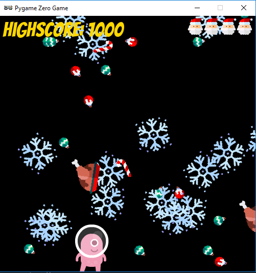

# A christmas game

This repo contains a prototype for a game with Pygame Zero. And this is how it looks.

# Installation
You want to try it out?

1. Download the Mu Editor [here](https://codewith.mu/).
2. Download this repo and put the files in the dedicated mu_code folders.
3. Start the game with Mu.

# Attribution

All images used are delivered either by [Mu Editor](https://codewith.mu/) or by [Freepik](https://www.flaticon.com/authors/freepik) within the [Christmas Party 3 Pack](https://www.flaticon.com/packs/christmas-party-3).
